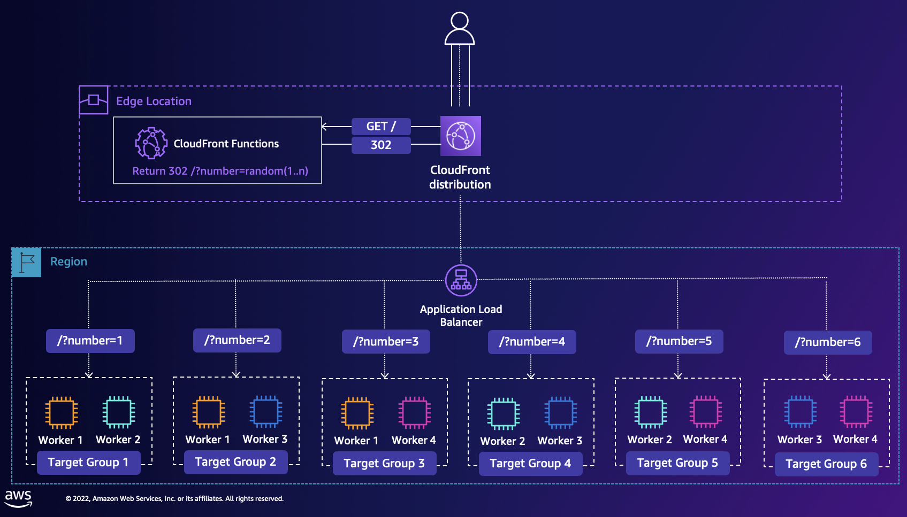

# Shuffle Sharding Demo for Tel-Aviv Summit 2022

This project includes a demo of Shuffle Sharding solution using Cloudfront and ALB Target groups. The CloudFront distribution (the main entry point to the application) runs a CloudFront Function that allocates a random key, and returns a redirect (302) response to the user with the generated key, and the user is redirected to one of the Target Groups.



The project is written with CDK. It can be used to deploy a full solution of Shuffle Sharding with ALB and CloudFront Function. The CDK Code allows customization of the instance layout with an algorithm to calculate the Blast Radius of the selected layout. Use the CDK ls command to compare the blast radius with and without Shuffle Sharding, and with a different number of instances.

The CDK will also deploy a front end to illustrate the selected layout.


The front-end runs with the following technologies:

2. [Flask Server](flask-server/main.py) (Python Web Server) runs on the EC2 Machines using the [userdata.sh](lib/userdata.sh) script
3. [React application](react-app/src/App.js) shows the server layout and shows illustration of the Application Load Balancer Target Groups

# How to use the code

1. Edit [bin/summit2022-demo.ts](bin/summit2022-demo.ts) with your AWS Account and region
2. Edit [lib/summit2022-demo-stack.ts](lib/summit2022-demo-stack.ts) with your instance layout

## Example layout:

```typescript
const instances: aws_ec2.Instance[] = this.createWorkers(4, 't3.medium');
..
const numberOfGroups = this.createGroups(instances, {
  sharding: { enabled: true, shuffle: true },
});
```

This code sample will deploy 4 EC2 Instances and create and 6 virtual shards (With Shuffle Sharding enabled)

Now run `cdk ls`

```
 cdk ls
🌎 Creating EC2 Instances in 3 Availability Zones 🌎
New virtual shard for all VMs assigned to ALB at /
New group #1 : 'Worker1' and 'Worker2'
New group #2 : 'Worker1' and 'Worker3'
New group #3 : 'Worker1' and 'Worker4'
New group #4 : 'Worker2' and 'Worker3'
New group #5 : 'Worker2' and 'Worker4'
New group #6 : 'Worker3' and 'Worker4'
New virtual shard: Worker1-Worker2 assigned to ALB at /?number=1
New virtual shard: Worker1-Worker3 assigned to ALB at /?number=2
New virtual shard: Worker1-Worker4 assigned to ALB at /?number=3
New virtual shard: Worker2-Worker3 assigned to ALB at /?number=4
New virtual shard: Worker2-Worker4 assigned to ALB at /?number=5
New virtual shard: Worker3-Worker4 assigned to ALB at /?number=6

♦️ Total of 4 hosts (t3.medium) and 6 virtual shards ♦️
💥 Blast radius = 16.67% 💥

ShuffleShardingDemoSummit2022
```

## Deployment

```bash
git clone <repo url>
cd <repo folder name>
# Edit <summit2022-demo.ts> with your AWS Account id
npm install
cdk bootstrap
cdk deploy ShuffleShardingDemoSummit2022
```

Deployment output

```
✨  Deployment time: 506.04s

Outputs:
ShuffleShardingDemoSummit2022.CloudfrontURL = https://d2vya18zme2enk.cloudfront.net
ShuffleShardingDemoSummit2022.CloudwatchDashboardURL = https://console.aws.amazon.com/cloudwatch/home?region=us-east-1#dashboards:name=ShuffleShardingSummit2022
ShuffleShardingDemoSummit2022.LoadBalancerEndpointRoundRobin = http://Shuff-AppLo-CHDJ7TUUX2C8-1489902245.us-east-1.elb.amazonaws.com/?number=100
ShuffleShardingDemoSummit2022.LoadBalancerEndpointWorker1Worker2 = http://Shuff-AppLo-CHDJ7TUUX2C8-1489902245.us-east-1.elb.amazonaws.com/?number=1
ShuffleShardingDemoSummit2022.LoadBalancerEndpointWorker1Worker3 = http://Shuff-AppLo-CHDJ7TUUX2C8-1489902245.us-east-1.elb.amazonaws.com/?number=2
ShuffleShardingDemoSummit2022.LoadBalancerEndpointWorker1Worker4 = http://Shuff-AppLo-CHDJ7TUUX2C8-1489902245.us-east-1.elb.amazonaws.com/?number=3
ShuffleShardingDemoSummit2022.LoadBalancerEndpointWorker2Worker3 = http://Shuff-AppLo-CHDJ7TUUX2C8-1489902245.us-east-1.elb.amazonaws.com/?number=4
ShuffleShardingDemoSummit2022.LoadBalancerEndpointWorker2Worker4 = http://Shuff-AppLo-CHDJ7TUUX2C8-1489902245.us-east-1.elb.amazonaws.com/?number=5
ShuffleShardingDemoSummit2022.LoadBalancerEndpointWorker3Worker4 = http://Shuff-AppLo-CHDJ7TUUX2C8-1489902245.us-east-1.elb.amazonaws.com/?number=6
```

# Project Requirements

## Pre requirements:

### CDK Part to test and deploy the demo (without local debugging of the front end)

1. Node.js Installed
2. AWS CLI Configured with IAM User/Role
3. CDK CLI Installed

### Front end part

1. Python3
2. Pip3

#### Front end local run:

```bash
git clone <repo url>
cd <repo folder name>
npm install --prefix ./react-app
npm run build --prefix ./react-app  # will generate files to './flask-server/static/react'
pip3 install -r flask-server/requirements.txt
python3 flask-server/main.py # to start the web server
```
